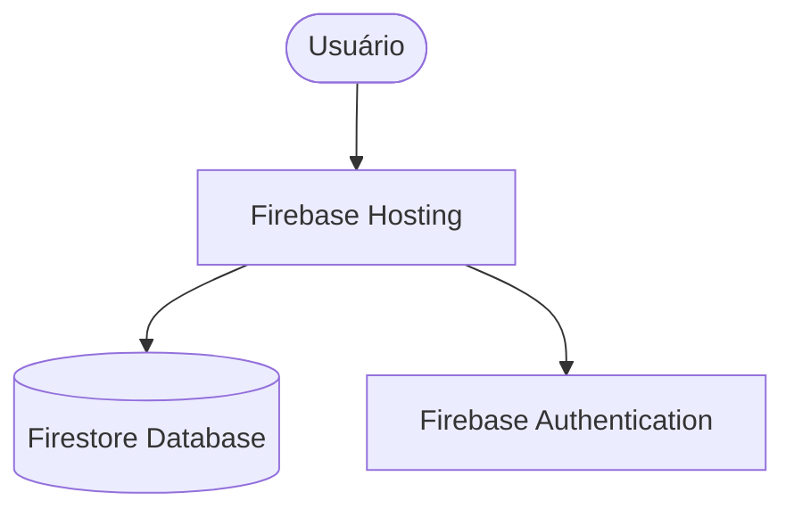

# Arquitetura do Sistema: Campo Branco

Este documento detalha a infraestrutura e a arquitetura técnica do projeto Campo Branco, servindo como guia para desenvolvedores e administradores do sistema.

## 1. Visão Geral da Infraestrutura

O sistema utiliza uma arquitetura híbrida baseada no **Google Cloud Platform (GCP)** e no **Firebase**, otimizada para performance (SSR), baixo custo e facilidade de deploy.


```mermaid
graph TD
    User([Usuário]) --> FH["Firebase Hosting"]
    FH --> DB[(Firestore Database)]
    FH --> Auth[Firebase Authentication]
```

## 2. Estratégia de Ambientes e CI/CD

O sistema utiliza **GitHub Actions** para automação de deploy, segregando as instâncias por branch:

| Ambiente | Branch | URL Hosting | Projeto Firebase | Banco (Firestore) |
| :--- | :--- | :--- | :--- | :--- |
| **Local** | N/A | `localhost:3000` | `campobrancodev` | `campobrancodev` (Test) |
| **Staging** | `dev` | `campobrancodev.web.app` | `campobrancodev` | `campobrancodev` (Test) |
| **Produção** | `main` | `campo-branco.web.app` | `campo-branco` | `campo-branco` (Prod) |

### 2.1 Workflows
*   `staging.yml`: Disparado ao fazer push na branch `dev`. Realiza build com chaves de produção e deploy no ambiente de teste.
*   `production.yml`: Disparado ao fazer push na branch `main`. Realiza build e deploy completos em produção.

## 3. Segurança (CSP)

A segurança é reforçada em duas camadas:
1.  **`firebase.json`**: Cabeçalhos aplicados em nível de rede.
2.  **`middleware.ts`**: Cabeçalhos injetados dinamicamente pelo Next.js.

**Diretivas Principais:**
*   `script-src`: Permite Google APIs, Firebase e Leaflet (`unpkg.com`). Adicionado `blob:` para Service Worker.
*   `img-src`: Permite mapas (OpenStreetMap, CartoDB), Storage do Firebase e `blob:`.
*   `frame-src`: Necessário para o fluxo de login do Firebase.
*   `connect-src`: Inclui analytics e recursos dinâmicos do Leaflet/CartoDB.

## 4. Banco de Dados e Autenticação

*   **Firestore:** Banco NoSQL centralizado no banco `default`.
*   **Auth:** Utiliza Firebase Auth com suporte a domínios personalizados via proxy.

## 5. Estrutura do Banco de Dados (Padrão Híbrido)

Para garantir compatibilidade com os dados originais e facilitar a leitura programática, o projeto utiliza um **Padrão Híbrido** de nomenclatura:

- **COLEÇÕES (Coletores):** Utilizam `snake_case` (letras minúsculas com underscore).
    - Exemplos: `shared_lists`, `witnessing_points`, `bug_reports`, `territory_addresses`.
- **CAMPOS (Atributos):** Utilizam `camelCase` (padrão JavaScript).
    - Exemplos: `congregationId`, `assignedTo`, `createdAt`, `updatedAt`, `visitStatus`.

> [!IMPORTANT]
> A partir da versão **v0.8.31-beta**, a migração de todos os campos legados para `camelCase` foi concluída. O código agora é limpo e não possui mais suporte a fallbacks `snake_case`. Qualquer nova implementação deve seguir estritamente o padrão camelCase para campos.

### 5.1 Estratégia de Resiliência (Legacy Support - REMOVIDO)
> [!NOTE]
> O suporte a campos legados em `snake_case` (ex: `congregation_id`) foi removido em favor de um código mais limpo e performático, após a migração bem-sucedida de todos os documentos no Firestore.

## 6. Manutenção e Deploy

### Comandos Úteis
*   `firebase deploy`: Realiza o deploy completo (Hosting + Rules).
*   `npm run rules:dev`: Deploy das regras no ambiente de desenvolvimento.
*   `npm run build`: Gera a versão estática do app.

---
> [!IMPORTANT]
> O projeto é 100% configurável via variáveis de ambiente. Verifique o arquivo `env.example` para as chaves necessárias.

## 7. Migração para Plano Spark (Mar/2026)

Para eliminar custos e dependência de cartão de crédito, o sistema utiliza uma arquitetura **Static-First** compatível com o plano gratuito (Spark) do Firebase.

### 🔄 Mudanças Principais:
- **Zero Trust Security:** A segurança foi movida inteiramente para o **Firestore Security Rules**, validando permissões diretamente no banco de dados.
- **Client-Side Logic:** Toda a lógica foi migrada para serviços de cliente (`lib/services/**`) utilizando o Firebase Client SDK.

### 📊 Desnormalização de Estatísticas de Bairro (Fase 2 - Jun/2026)
Para otimizar o carregamento do Dashboard inicial e eliminar queries massivas client-side (que causavam alta latência e exibiam cartões zerados `0/0`), implementamos contadores desnormalizados nos bairros (`cities/{cityId}`).

#### Estrutura do Documento:
Os contadores são armazenados em um objeto aninhado `stats` no documento de cada bairro:
```javascript
// Documento em cities/{cityId}
{
  name: "Centro",
  congregationId: "cong-123",
  stats: {
    totalTerritories: 15,  // Total de territórios vinculados ao bairro
    totalAddresses: 320    // Total APENAS de endereços ATIVOS (isActive == true)
  }
}
```

#### Invariantes de Consistência:
1. **Regras de Escrita Granular (Firestore Rules)**: As regras de segurança garantem que apenas a chave raiz `stats` seja modificada em operações transacionais de contadores, prevenindo modificações maliciosas diretas em outros campos do bairro.
2. **Filtro de Atividade**: O contador `totalAddresses` computa exclusivamente endereços ativos (`isActive == true`). Mutações que alteram a atividade (`isActive: true <-> false`) ou excluem endereços realizam o incremento/decremento atômico via `FieldValue.increment()`.
3. **Escrita em Lote (WriteBatch)**: Todas as criações, deleções (incluindo exclusão em cascata de território) e modificações de status de atividade são executadas via `writeBatch` no client-side para garantir atomicidade.
4. **Resiliência e Recálculo**: A edição que altera o `cityId` de um endereço existente está fora do escopo de atualização transacional automática client-side. Em vez disso, a integridade é garantida pela rotina utilitária `recalculateCityStats` que realiza o recálculo administrativo via contagens nativas do servidor (`getCountFromServer`).

---

## 8. Instalação e Primeiro Acesso (Zero Configuration Admin)

*   **Master Admin**: O primeiro acesso administrativo é definido pela variável `NEXT_PUBLIC_MASTER_EMAIL`.
*   **Promoção Automática**: Se o usuário logado corresponder a este e-mail, o `AuthContext` cria ou atualiza o perfil Firestore com o papel `ADMIN` automaticamente.

---
### 📈 Registro de Melhorias Recentes:
- **v0.9.13-beta**: **BDD Core Domain e Proteção de Concorrência**. (16/06/2026)
  - Extração de regras comportamentais puras para `lib/domain/territoryRules.ts` garantindo consistência na máquina de estados de territórios.
  - Substituição cega de `writeBatch` por `runTransaction` no `lib/services/shared_lists.ts`, garantindo atomicidade real para designação e devolução de territórios.
  - Modificação do método `deleteTerritory` para bloqueio seguro de exclusão quando existirem dependências, em vez de exclusão em cascata.
  - Inserção de 13 cenários de testes unitários testando corrupção de dados, ownership e transições de estado.
- **v0.9.12-beta**: **QA e Modularização de RBAC**. (16/06/2026)
  - Refatoração da lógica de permissões do `AuthContext` para `lib/rbac.ts` visando testabilidade pura (desacoplada do React/Firebase).
  - Implementação de 10 testes unitários com Jest (`__tests__/rbac.test.ts`) cobrindo todos os perfis de hierarquia e Edge Cases.
- **v0.9.11-beta**: **Padronização Open Source**. (16/06/2026)
  - Remoção de redirecionamentos fixos de domínio legados via código (`layout.tsx`) para garantir que *forks* funcionem sem acoplamento.
  - Limpeza de variáveis obsoletas de ambiente (`NEXT_PUBLIC_LEGACY_HOST`) e de configuração (`DOMAIN_REDESIGN`).
- **v0.9.10-beta**: **Limpeza de Dívida Técnica e Auditoria Documental**. (16/06/2026)
  - **Limpeza**: Remoção de arquivos legados do Firebase Admin SDK (`lib/auth.ts`, `lib/firebase-admin.ts`, etc.) após consolidação da arquitetura Static-First.
  - **Testes**: Exclusão de testes de integração antigos baseados no backend removido e sincronização do `package.json` com o `README.md`.
  - **Ação CI/CD**: Adição de documentação oficial para replicação Open Source do deploy via GitHub Actions.
- **v0.9.9-beta**: **Desnormalização de Estatísticas de Bairro**. (15/06/2026)
  - **Fase 2**: Implementada a contagem desnormalizada de territórios (`totalTerritories`) e endereços ativos (`totalAddresses`) no documento de cada bairro/cidade.
  - **Mutações**: Adicionado controle transacional atômico direto no cliente via `writeBatch` e `increment()` na criação, edição (inativação/reativação) e exclusão (em cascata) de entidades.
  - **Resiliência**: Criada rotina `recalculateCityStats` para manutenção e recálculo baseada no `getCountFromServer()`.
- **v0.9.8-beta**: **Ajuste de Gênero Gramatical em Mensagens de Cidade/Bairro**. (15/06/2026)
  - **Refinamento**: Corrigida a concordância nominal de gênero nas mensagens de feedback (toasts) de criação, edição e exclusão. Agora o sistema exibe corretamente "Bairro excluído/criado/atualizado" ou "Cidade excluída/criada/atualizada" de acordo com o tipo de termo da congregação, eliminando o sufixo genérico "excluído(a)".
- **v0.9.7-beta**: **Correção de Vazamento de Memória e Erro Leaflet no Mapa**. (15/06/2026)
  - **Correção**: Implementado o rastreamento correto de marcadores de cidades, bairros e endereços no `markersRef` em `MapView.tsx`, limpando-os durante as re-renderizações e no desmonte. Isso previne o erro `Cannot read properties of undefined (reading '_leaflet_pos')` do Leaflet ao alterar ou invalidar o tamanho do mapa.
- **v0.9.1-beta**: **Sincronização de Exclusão no Dashboard**. (20/05/2026)
  - **Correção**: Atualizados os estados locais `myAssignments`, `pendingMapsCount` e `expiringMaps` nas funções `handleDeleteShare` e `handleRemoveResponsible` no dashboard principal, garantindo que o cartão seja removido da visualização "Meus Cartões" sem a necessidade de refresh.
- **v0.8.55-beta**: **Sincronização com GitHub Dev**. (22/03/2026)
  - **Entrega**: Sincronização do estado atual do projeto com o repositório remoto na branch `dev`.
- **v0.8.54-beta**: **Sincronização Final da Automação**. (20/03/2026)
  - **Entrega**: Consolidação de todas as features do Instalador Visual e suporte a comandos paralelos. Walkthrough final gerado.
- **v0.8.53-beta**: **Fidelidade Total ao Padrão .env**. (20/03/2026)
  - **Integridade**: A geração de arquivos agora preserva 100% da estrutura, comentários e ordem do modelo original, atualizando apenas os valores.
- **v0.8.52-beta**: **Padronização de Envs**. (20/03/2026)
  - **Organização**: Os arquivos `.env` gerados agora seguem um template estruturado com comentários e seções organizadas.
- **v0.8.51-beta**: **Comandos Paralelos no Gerenciador**. (20/03/2026)
  - **Flexibilidade**: Agora é possível sincronizar regras ou fazer deploy para teste enquanto o servidor local está rodando, sem bloqueio de interface.
- **v0.8.50-beta**: **Automação e Controle de Fluxo**. (20/03/2026)
  - **Novidades**: Abertura automática do navegador ao iniciar localhost. Adicionado botão "Interromper" para encerrar o servidor via interface.
- **v0.8.48-beta**: **Ajuste de Nomenclatura**. (20/03/2026)
  - **UI**: Botões de desenvolvimento renomeados para maior clareza ("Ver em Local", "Teste online").
- **v0.8.47-beta**: **Detecção Automática de Envs**. (20/03/2026)
  - **Navegação**: O instalador agora pula para o painel de controle se o `.env` do ambiente selecionado já existir.
- **v0.8.46-beta**: **Automação de Inicialização**. (20/03/2026)
  - **Eficiência**: O botão "Iniciar Servidor Dev" agora executa `npm install` automaticamente antes da execução principal.
- **v0.8.45-beta**: **Refino Visual do Instalador**. (20/03/2026)
  - **Limpeza**: Removidos botões redundantes (Build/Instalar) do painel principal para um fluxo mais direto. Estrutura HTML corrigida.
- **v0.8.44-beta**: **Configuração Única Sincronizada**. (20/03/2026)
  - **Melhoria**: O Instalador Visual agora pré-carrega dados salvos e possui opção para sincronizar as mesmas credenciais entre DEV e PROD com um clique.
- **v0.8.43-beta**: **Instalador Visual e Plug-and-Play**. (20/03/2026)
  - **Novidade**: Criado `install.bat` e assistente web para configuração inicial (Firebase + Master Email).
  - **Dev/Prod**: Fluxos separados para deploy em Staging ou Produção com preenchimento dinâmico de `.env`.
- **v0.8.42-beta**: **Configuração de Ambiente DEV**. (20/03/2026)
  - **Infra**: Sincronizado `apphosting.yaml` com o projeto `campobrancodev` e adicionada variável `NEXT_PUBLIC_MASTER_EMAIL`, corrigindo acesso ADMIN em ambiente de staging.
- **v0.8.41-beta**: **Resiliência de Relatórios**. (20/03/2026)
  - **Build**: Corrigido erro de tipagem (`number | null`) no indicador de giro médio em `app/reports/page.tsx`.
- **v0.8.40-beta**: **Resiliência de Build e Consentimento**. (20/03/2026)
  - **Build**: Corrigido erro de propriedade duplicada (`termsAcceptedAt`) em `app/legal-consent/page.tsx`.
- **v0.8.39-beta**: **Correção de Dependências e Build**. (20/03/2026)
  - **Build**: Corrigida a falta do import `useState` em `app/invite/page.tsx` que impedia o build de produção.
- **v0.8.38-beta**: **Correção de Edição e Melhoria no Dashboard**. (20/03/2026)
  - **Edição**: Corrigida a falha onde o formulário de edição de endereço abria vazio; agora todos os dados são carregados corretamente.
  - **Dashboard**: Adicionada exibição do número e descrição (ex: "1 - Catiguá") no Centro de Ação para territórios inativos.
- **v0.8.37-beta**: **Personalização de Histórico e Relatórios**. (20/03/2026)
  - **Identidade**: Implementada resolução automática de nomes de usuários no Histórico de Território e Registro de Designação (PDF), eliminando o texto genérico "Usuário".
  - **Refinamento**: Adicionado filtro inteligente para evitar que o nome do território (utilizado como título de link) seja exibido indevidamente como nome do responsável no relatório.
  - **Correção de Dados**: Aplicado parsing robusto de data (`parseDate`) no Registro de Designação, corrigindo o erro de relatório vazio causado por objetos `Timestamp` do Firestore.
- **v0.8.36-beta**: **Compatibilidade de Tipos Firestore**. (20/03/2026)
  - **Relatórios**: Implementada função `parseDate` para suportar objetos `Timestamp` e objetos `seconds/nanoseconds` do Firebase, corrigindo indicadores de Giro e Cobertura.
  - **UX**: Alterada a exibição de "0" para "-" quando não houver histórico de giro suficiente, evitando confusão.
- **v0.8.35-beta**: **Resiliência de Dados e Limpeza UTF-8**. (20/03/2026)
  - **Relatórios**: Corrigido erro de `NaN` no card de Giro (Dias) através de validação de datas no processamento de histórico.
  - **Interface**: Limpeza em massa de caracteres UTF-8 corrompidos (`âš ï¸ ` e `•`) na página de administração de congregações.
- **v0.8.34-beta**: **Área Administrativa e Estabilidade**. (20/03/2026)
  - **Administração**: Padronizados os menus de Congregações (`admin/congregations`) e Membros (`admin/users`) com o componente `DropDownItem`.
  - **Correção Crítica**: Resolvido erro de sintaxe JSX em `my-maps/address/page.tsx` que impedia a renderização da página.
  - **UX Administrativa**: Adicionado suporte a fechamento interativo em todos os menus administrativos.
- **v0.8.33-beta**: **Padronização Visual Completa e Witnessing UX**. (20/03/2026)
  - **Witnessing Points**: Padronizados os menus de pontos de testemunho em `witnessing/city/page.tsx` com `DropDownItem`.
  - **Tabela de Territórios**: Implementada a padronização de menus na visualização em lista/tabela de endereços dentro de `my-maps/territory/page.tsx`.
  - **Resiliência de Menus**: Adicionado fundo interativo (`fixed inset-0`) em todos os menus padronizados para garantir o fechamento ao clicar fora, melhorando a experiência em dispositivos móveis.
- **v0.8.32-beta**: **Padronização Visual de Menus e UX do Dashboard**. (20/03/2026)
  - **Identidade Visual**: Implementado o componente `DropDownItem` em todo o sistema para menus de contexto, folders e ações de endereço, garantindo uma estética premium com ícones circulares e cores variantes.
  - **Dashboard UX**: Corrigida a exibição de cartões concluídos para mostrar a data de conclusão ("Fim: [data]") em vez do contador de expiração.
  - **Consistência**: Padronizados os menus em `SharedListView`, `AddressActionsMenu`, `CityPage`, `TerritoryPage`, `AddressPage` e `DashboardCards`.
  - **Limpeza de Legado**: Removidos redirecionamento de host legado e fallback de convite /invite antigo; migracao automatica de `currentPublishers` para `activeUsers` nos pontos de testemunho.
- **v0.8.31-beta**: **Migração Completa para camelCase e Limpeza de Código**.
  - **Fim do Legado**: Removido todo o suporte a campos `snake_case` no frontend (fallbacks e queries `or`).
  - **Data Migration**: Executado script de migração para converter todos os documentos existentes para o padrão `camelCase`.
  - **Simplificação**: Queries do Firestore agora são mais eficientes, utilizando filtros diretos em vez de operadores `or` complexos.
  - **AuthContext**: Removida detecção de congregação via `congregation_id`.
- **v0.8.30-beta**: **Resiliência de Dados e Feedback Visual**.
  - **Urgência**: Corrigido o sumiço dos cartões no Dashboard devido a inconsistências de `snake_case` vs `camelCase` no banco.
  - **Auth Resilience**: `AuthContext` agora detecta a congregação mesmo se o campo for `congregation_id`.
  - **Queries**: Implementado `or()` em todas as queries do Dashboard para suportar campos legados.
  - **UX**: Adicionada mensagem "Nenhum cartão encontrado" quando a lista está vazia, evitando quadros brancos.
  - **SharedView**: Aplicada a mesma lógica de resiliência nos links compartilhados.
- **v0.8.29-beta**: **Reversão Final para Padrão Híbrido**.
  - **Decisão Arquitetural**: Restaurada a estrutura original do banco de dados: Coleções em `snake_case` e Campos em `camelCase`.
  - Reversão de todas as mudanças que tentaram forçar `snake_case` nos campos (ex: `congregation_id` -> `congregationId`).
  - Atualização das `firestore.rules` para realizar o `data.get()` em `camelCase`, corrigindo o erro de permissão que impedia a visualização do Dashboard.
  - Sincronização de todos os serviços (`lib/services/`) para garantir que as queries batam com o esquema real do banco.
  - Limpagem técnica de `ARQUITETURA.md` removendo seções duplicadas.
- **v0.8.14-beta**: Padronização anterior de interface e status de visitas.
- **v0.7.42-beta**: Acesso Público total para links compartilhados.
